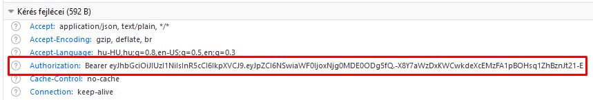

# Felhasználókezelés, autentikáció (kiegészítő anyag)
Elkészült alkalmazásunkat felhasználókezeléssel szeretnénk ellátni. 

Célunk a legalapvetőbb autentikációs folyamatok implementálása, melynek során olyan technológiákat ismerünk meg, amiket valós rendszerekben is alkalmaznak.

Nem törekszünk azonban a teljességre, a tutorial végére elkészülő alkalmazásunk csak további védelmi funkciók implementálása után állna készen arra, hogy élesben is biztonságosan üzemeljen. Ezek a „Továbbfejlesztési lehetőségek” fejezetben vannak felsorolva.

## Tartalom

- [Kezdő projekt](#kezd-projekt)
- [Cél](#cl)
- [JWT](#jwt)
- [Szerveroldal védelme](#szerveroldal-vdelme)
    * [Felhasználói regisztráció](#felhasznli-regisztrci)
    * [Bejelentkezés](#bejelentkezs)
    * [HTTP végpontok védelme](#http-vgpontok-vdelme)
- [Kliensoldal védelme](#kliensoldal-vdelme)
    * [Regisztrációs felület](#regisztrcis-fellet)
    * [Token kezelés](#token-kezels)
    * [Bejelentkezés](#bejelentkezs-1)
    * [HTTP kérések kezelése](#http-krsek-kezelse)
    * [HTTP válaszok kezelése](#http-vlaszok-kezelse)
    * [Útvonalak védelme](#tvonalak-vdelme)
    * [Kilépés](#kilps)
    * [UI elemek elrejtése](#ui-elemek-elrejtse)
- [Továbbfejlesztési lehetőségek](#tovbbfejlesztsi-lehetsgek)

## Kezdő projekt

Kezdésképpen a  projektet [töltsük le innen](assets/banking-app-auth.zip), hogy közös kódbázisból induljunk!

Tartalmát csomagoljuk ki valahova, majd a megfelelő könyvtárból kiindulva futtassuk az `npm install` parancsot!

Ezt követően nyissuk meg a projektet VSCode-ban, majd a megszokott `npm run start:server` és `npm run start:client` parancsokkal indítsuk el!

Figyeljünk rá, hogy a `server/src/data-source.ts` fájl a megfelelő adatokat tartalmazza az adatbázis eléréséhez!

## Cél

Célunk, hogy az olvasási műveletekhez (pl. felhasználók listázása) bárki hozzáférhessen, míg írási műveleteket (pl. új felhasználó hozzáadása) kizárólag regisztrált és bejelentkezett felhasználók hajthassanak végre a rendszerben!

Nem célunk ugyanakkor ezen kívül más védelmi mechanizmusok alkalmazása (pl. annak megoldása, hogy a felhasználó csak a saját nevében tudjon tranzakciókat kezdeményezni. Tekinthetjük ezt úgy is, hogy regisztrált felhasználók mindegyike Adminisztrátori jogkörrel rendelkezik.

## JWT

Autentikációnk alapjául ún. "JSON Web Token-eket" (JWT) fogunk használni. A tutorial további részének megértéséhez elengedhetetlen ezek alapvető ismerete.

A JWT működésének nézzünk utána [itt](https://supertokens.com/blog/what-is-jwt) és/vagy [itt](https://dev.to/kcdchennai/how-jwt-json-web-token-authentication-works-21e7)!

Összefoglalásképpen elmondható, hogy a JSON Web Token egy nyílt szabványban definiált JSON adatszerkezet, amely egy biztonságos és standardizált módszert biztosít az azonosításra és az adatátvitelre az interneten. A JWT tokenek lehetővé teszik az alkalmazások számára, hogy a felhasználók azonosítását és jogosultságkezelést végezzenek.

A JWT tokenek az alábbi három részből állnak:

- **Fejléc (Header)**: Tartalmazza a tokentípust és az algoritmust, amelyet használnak a token aláírásához és ellenőrzéséhez.
- **Adattartalom (Payload)**: Ebben a részben találhatók a felhasználóra vagy az alkalmazásra vonatkozó információk, például a felhasználói azonosító, a jogosultságok, az időkorlátok és egyéb metaadatok.
- **Aláírás (Signature)**: Ez a rész a fejléc és a payload érvényességét biztosítja az aláírás segítségével, amely az előző két részből számítódik ki a titkos kulcs segítségével.

A szolgáltató a JWT token érvényességét az alábbi módon ellenőrzi:

1. Ellenőrzi a token aláírását, hogy megbizonyosodjon arról, hogy a token valóban általa lett-e kiállítva.
2. Ellenőrzi a tokent tartalmazó payloadban szereplő `"exp"` (lejárati idő) adatot, hogy megállapítsa, a token még érvényes-e. Ha a token lejárt, akkor a szolgáltató nem fogja elfogadni.
3. Ha a token hitelesnek és érvényesnek bizonyul, akkor a felhasználó azonosítása sikeres, és a szolgáltató használhatja a payload-ban található információkat.

## Szerveroldal védelme

Először a szerveroldal védelmét fogjuk kialakítani. Ehhez regisztrációs és bejelentkezési lehetőséget kell biztosítani a felhasználók számára, majd implementálni kell a rendszer írási műveleteinek védelmét.

### Felhasználói regisztráció

Elsőként módosítsuk az adatbázist, a `User` entitáshoz adjuk hozzá a következő mezőket, ezeket fogjuk használni a beléptetéshez:

```ts
@Column({ unique: true })
email: string;

@Column({ select: false })
password: string;
```

A `password` mezőhöz tartozó `select` tulajdonságot `false`-ra állítottuk, így alapértelmezetten a felhasználó jelszava nem fog lekérdezésre kerülni, csak akkor, ha arra ténylegesen szükségünk van. Az `email` mezőre `unique` tulajdonságot állítottunk be, ez garantálja, hogy több felhasználónak ne lehessen azonos email címe.

Ha a szerver indításakor `.Duplicate entry '' for key 'user.IDX_e12875dfb3b1d92d7d7c5377e2' ...` hibaüzenetet kapunk, futtassuk az alábbi SQL parancsot, hogy létező felhasználóink egyedi email cmet kapjanak: ``UPDATE `user` SET email=CONCAT(id, '@example.com');``

A regisztráció során a megadott jelszóból [bcrypt](https://en.wikipedia.org/wiki/Bcrypt) algoritmus segítségével [hash kódot fogunk képezni](https://nordpass.com/blog/password-hash/). Így a felhasználó jelszavát nem tároljuk (a hash kód közvetlenül nem fejthető vissza), azonban a bejelentkezéskor ellenőrizni tudjuk, hogy helyes jelszót adott-e meg. Telepítsük ehhez a `bcrypt` csomagot, és az automatikus kódkiegészítéshez szükséges típusokat:

```
npm install bcrypt
npm install @types/bcrypt --save-dev
```

Ezt követően a `UserController`-ben definiáljuk felül a `Controller` osztályból érkező `create` metódust, hiszen most már nem csak a beérkezett adatok mentését kell elvégeznünk, hanem hash-eljük is a felhasználó által megadott jelszót annak eltárolása előtt:

```ts
import { Controller } from "./base.controller";
import { AppDataSource } from "../data-source";
import { User } from "../entity/User";

import bcrypt from 'bcrypt';

export class UserController extends Controller {
    repository = AppDataSource.getRepository(User);

    create = async (req, res) => {
        try {
            const entity = this.repository.create(req.body as User);
            delete entity.id;

            const insertedEntity = await this.repository.save(entity);
            insertedEntity.customerId = insertedEntity.id.toString().padStart(6, '0');

            entity.password = await bcrypt.hash(entity.password, 12);

            await this.repository.save(insertedEntity);

            res.json(insertedEntity);
        } catch (err) {
            this.handleError(res, err);
        }
    };
}
```

Teszteljük a regisztráció működését Postman segítségével, pl. az alábbi adatokkal:

```json
{
    "firstName": "Példa",
    "lastName": "Béla",
    "email": "user@example.com",
    "password": "admin123"
}
```

A kérést a `POST http://localhost:3000/api/users` végpontra kell küldeni.

Az adatbázisban a jelszóhoz tartozó hash-nek meg kell jelennie a hozzáadott felhasználónál.

### Bejelentkezés

Ezt követően tegyük lehetővé a bejelentkezést! Ennek során ellenőriznünk kell, hogy a felhasználó által megadott e-mail cím és jelszó egyezik-e az adatbázisban tárolt adatokkal. Amennyiben igen, JWT tokent kell kiállítani a kliens számára.

Adjunk hozzá egy `login` metódust a `UserController`-hez:

```ts
login = async (req, res) => {
    try {
        const user = await this.repository.findOne({
            where: { email: req.body.email },
            select: [ 'id', 'password' ]
        });

        if (!user) {
            return this.handleError(res, null, 401, 'Incorrect email or password.');
        }

        const passwordMatches = await bcrypt.compare(req.body.password, user.password);
        if (!passwordMatches) {
            return this.handleError(res, null, 401, 'Incorrect email or password.');
        }

        // TODO: generate JWT token

        res.json({ success: true });
    } catch (err) {
        this.handleError(res, err);
    }
};
```

Majd a `routes.ts`-ben kössük hozzá a bejelentkezési műveletet a `/users/login` útvonalhoz:

```ts
router.post('/user/login', userController.login);
```

Teszteljük Postman-ben, hogy mi történik megfelelő, illetve hibás adatok beküldése esetén! Kérésünkben az `email` és `password` mezőket kell szerepeltetni, pl.:

```json
{
    "email": "user@example.com",
    "password": "admin123"
}
```

Ezt követően implementáljuk a JWT token generálását! Ehhez telepítsük a `jsonwebtoken` csomagot és a hozzá tartozó típusdefiníciókat:

```
npm install jsonwebtoken
npm install @types/jsonwebtoken --save-dev
```

A `UserController`-ben importáljuk a csomagot:

```ts
import jwt from 'jsonwebtoken';
```

Majd a `login` metódus végén szereplő TODO-t és `res.json` hívást cseréljük ki a következőre:

```ts
const token = jwt.sign({ id: user.id }, 'mySecretKey', { expiresIn: '2w' });
res.json({ accessToken: token });
```

A fenti 2 sorban egy JWT tokent hozunk létre, melynek payload részében a felhasználó azonosítója szerepel. A token aláírását a `mySecretKey` titkos kulccsal végezzük el (később, a token ellenőrzésekor ezt még használnunk kell!). A token lejáratát 2 hétre állítottuk, ezt követően a felhasználónak újra be kell majd lépnie.

Teszteljük a belépést Postman-ben újra! A visszakapott JWT token tartalmát ellenőrizhetjük is, a https://jwt.io/ webhelyen.

**Mentsük is el a kapott tokent, a fejlesztés során ezt még használni fogjuk!**

### HTTP végpontok védelme

A regisztrációt és a belépést már megvalósítottuk, következő feladatunk a szerver által biztosított írási műveletek védelme.

Ehhez először telepítsük az `express-jwt` csomagot, ami a beérkező kérésben megkeresi a JWT tokent, majd ellenőrzi, hogy az érvényes-e (a saját titkos kulcsunkkal lett-e aláírva), és nem járt-e még le:

```
npm install express-jwt
```

A `server/src/` könyvtáron belül hozzunk létre egy fájlt `protect-routes.ts` néven, ebbe fognak kerülni a JWT token ellenőrzéséhez szükséges middleware-k:

```ts
import { expressjwt } from "express-jwt";

export const checkUser = expressjwt({
    secret: "mySecretKey",
    algorithms: ["HS256"]
});

export const handleAuthorizationError = (err, req, res, next) => {
    if (err.name === "UnauthorizedError") {
        res.status(401).send({ error: 'Authentication is required for this operation.' });
    } else {
        next(err);
    }
};
```

A `checkUser` függvény ellenőrzi a JWT tokent (a beállított titkos kulcs és a JWT token aláírásához használt algoritmus alapján), melyet alapértelmezetten a kérés `Authorization` nevű fejlécéből olvas ki. A fejlécnek a következő formátumot kell követnie: `Authorization: Bearer <jwt_token>`.

A `handleAuthorizationError` függvény kezeli azt, ha a token valamilyen okból nem érvényes (pl. érvénytelen az aláírása vagy lejárt), vagy nem is szerepel a kérésben.

A `routes.ts` fájlban szereplő routerben alkalmazzuk a `checkUser` függvényt minden írási műveletre (kivéve a regisztrációra, amit el kell érnie a vendégeknek is):

```ts
import { checkUser } from './protect-routes';

export function getRouter() {
    const router = express.Router();

    const userController = new UserController();

    router.get('/user', userController.getAll);
    router.get('/user/:id', userController.getOne);
    router.post('/user', checkUser, userController.create);
    router.post('/user/login', userController.login);
    router.put('/user', checkUser, userController.update);
    router.delete('/user/:id', checkUser, userController.delete);

    const transactionController = new TransactionController();
    router.post('/transaction', checkUser, transactionController.create);
    router.get('/transactions/of/:userId', transactionController.getTransactionsOfUser);

    const categoryController = new CategoryController();
    router.get('/category', categoryController.getAll);

    return router;
}
```

A megfelelő útvonalak esetében a kontroller metódus elé így plusz lépésként beékelődik a JWT token ellenőrzése is.

Kezeljük azt az esetet, amikor a `checkUser` middleware hibát dob! Ehhez az `index.ts` fájlban módosítsuk a router regisztrációját a következőképpen:

```ts
app.use('/api', getRoutes(), handleAuthorizationError);
```

Hiba esetén így a `handleAuthorizationError` függvény fut le, mely megfelelő státuszkódot és hibaüzenetet küld vissza a kliensnek. Ha ezt a middleware-t nem használnánk, az Express alapértelmezett, HTML alapú hibaoldala jelenne meg helyette.

Most küldjünk egy kérést Postman-ben, pl: `GET http://localhost:3000/api/user/1`

Mivel ez egy olvasási művelet, a megfelelő termék adatait kell visszakapnunk.

Most próbáljuk meg törölni a terméket: `DELETE http://localhost:3000/api/user/1`

Ebben az esetben az autentikációra vonatkozó hibaüzenetet, és a `401 Unauthorized` státuszkódot kell visszakapnunk.

Váltsunk át a Postman-ben az "Authorization" fülre, a "Type" legördülő menüből válasszuk ki a "Bearer token" lehetőséget! Ezt követően a jobb oldalon szereplő "Token" mezőbe másoljuk be a [korábban elmentett](#bejelentkezs) JWT tokenünket! Ha átváltunk a "Headers" fülre, látható, hogy a Postman létrehozta az `Authorization` fejlécet, melyben a megadott token szerepel, a szerver által elvárt `Bearer <jwt_token>` formátumban.

Most küldjük be újra a törlésre vonatkozó kérést! Ha rendszerünk megfelelően működik, 200-as státuszkódot kell válaszként visszakapnunk. Ez azt jelenti, hogy a termék törlésre került.

Szerveroldalunk védelmével el is készültünk. Nézzük a kliensoldalt!

## Kliensoldal védelme

A kliensoldal esetében a védelem azt fogja jelenti, hogy a szerverről kapott JWT tokent eltároljuk, és azt minden kérésbe beletesszük.

Ezen túlmenően elsősorban annyi a dolgunk, hogy a felhasználó által nem elérhető műveletekhez tartozó grafikus elemeket elrejtsük, amennyiben a felhasználónk nem jelentkezett be.

### Regisztrációs felület
A regisztrációs felület létrehozásában nincs újdonság, egy form-ot kell készítenünk, a megadott adatokat pedig a `/api/user` útvonalra POST-olnunk.

A felhasználói űrlap (`UserFormComponent`) gyakorlatilag felhasználható ehhez a feladathoz.

### Token kezelés

Hozzunk létre egy service-t, ami a felhasználó JWT tokenjét fogja tárolni, kezelni:

```
cd src/app/services
ng g s auth
cd ../../..
```

Implementáljuk a service-t a következő módon:

```ts
import { Injectable } from '@angular/core';

@Injectable({
  providedIn: 'root'
})
export class AuthService {

  private TOKEN_KEY = 'accessToken';

  constructor() { }

  setToken(token: string) {
    localStorage.setItem(this.TOKEN_KEY, token);
  }

  getToken(): string | null {
    return localStorage.getItem(this.TOKEN_KEY);
  }

  removeToken() {
    localStorage.removeItem(this.TOKEN_KEY);
  }

  isLoggedIn(): boolean {
    return !!this.getToken();
  }
}
```

A tokent [LocalStorage-ban](https://developer.mozilla.org/en-US/docs/Web/API/Window/localStorage) tároljuk, mely az alkalmazásunkhoz tartozó kulcs-érték tároló. Használatára korábban, a ChatGPT projektünknél már láthattunk példát, itt tároltuk el a felhasználó nevét.

### Bejelentkezés
Bejelentkezés oldalunk létrehozása előtt egészítsük ki típusdefinícióinkat a `models/index.d.ts` fájlban a következőkkel:

```ts
export interface LoginDTO {
    email: string;
    password: string;
}

export interface AccessTokenDTO {
    accessToken: string;
}
```

Majd egészítsük ki a `UserService`-t a bejelentkezéshez szükséges kérést elküldő metódussal:

```ts
login(data: LoginDTO) {
    return this.http.post<AccessTokenDTO>('/api/user/login', data);
}
```

Készítsük el a bejelentkezési felületet! Ehhez generáljunk egy komponenst `LoginComponent` néven:

```
ng g c login
```

Az `app.routes.ts` fájlban rendeljünk hozzá egy útvonalat a komponensünkhöz:

```ts
{
    path: 'login',
    component: LoginComponent
},
```

Hozzuk létre a komponens kinézetét:

```html
<div class="row justify-content-md-center">
    <div class="col-md-6">
        <form [formGroup]="loginForm">
            <div class="mb-3">
                <label for="email" class="form-label">E-mail cím</label>
                <input type="email" class="form-control" id="email" formControlName="email">
            </div>
            <div class="mb-3">
                <label for="password" class="form-label">Jelszó</label>
                <input type="password" class="form-control" id="password" formControlName="password">
            </div>
            
            <div class="text-center">
                <button class="btn btn-outline-primary" (click)="login()">Belépés</button>
            </div>
        </form>
    </div>
</div>
```

Majd implementáljuk a hozzá tartozó osztályt is:

```ts
import { Component, inject } from '@angular/core';
import { FormBuilder } from '@angular/forms';
import { Router } from '@angular/router';
import { LoginDTO } from 'models';
import { ToastrService } from 'ngx-toastr';
import { AuthService } from '../services/auth.service';
import { UserService } from '../services/user.service';

@Component({
  selector: 'app-login',
  standalone: true,
  imports: [],
  templateUrl: './login.component.html',
  styleUrls: ['./login.component.css']
})
export class LoginComponent {
  loginForm = this.formBuilder.group({
    email: this.formBuilder.control(''),
    password: this.formBuilder.control('')
  });

  formBuilder = inject(FormBuilder);
  userService = inject(UserService);
  authService = inject(AuthService);
  router = inject(Router);
  toastrService = inject(ToastrService);

  login() {
    const loginData = this.loginForm.value as LoginDTO;

    this.userService.login(loginData).subscribe({
      next: (response) => {
        this.authService.setToken(response.accessToken);
        this.router.navigateByUrl('/');
      },
      error: (err) => {
        this.toastrService.error(err.error.error, 'Error');
      }
    });
  }
}
```

Sikeres belépés esetén a szerver által küldött JWT tokent elmentjük, majd a főoldalra navigálunk. Ha a szerverről hibaüzenet érkezik vissza, azt értesítésként megjelenítjük a felhasználó számára.

Ellenőrizzük, hogy hibás adatok esetén hibaüzenet jelenik-e meg, illetve be tudunk-e lépni a megfelelő adatok megadásakor!

Ezt követően hozzuk létre a "Belépés" menüt az `AppComponent` navigációs sávján, a többi menüpont után:

```html
<li class="nav-item">
    <a class="nav-link" routerLink="/login">Belépés</a>
</li>
```

### HTTP kérések kezelése

Az elmentett JWT tokent mostantól el kell helyeznünk minden, saját szerverünk felé kimenő kérésben. 

Alkalmazásunk külső API-t (pl. Google Maps) nem használ, így tulajdonképpen minden kimenő kérésben szerepeltethetjük a tokent. Ha mégis használnánk ilyen külső API-t, oda kellene figyelnünk arra, hogy csak a saját szerverünk felé menő kéréseknél történjen meg a token használata.

A szerver a következő formátumban várja a tokent: `Authorization: Bearer eyJhbGciOiJIUz...`

Ahhoz, hogy ezt minden kérésben szerepeltethessük, egy ún. [HttpInterceptor-t](https://angular.io/guide/http-intercept-requests-and-responses) fogunk használni, mely egy interfész, ami az `intercept()` metódust deklarálja. Ez a metódus minden kimenő kérés esetén le fog futni, segítségével többek között változtatni lehet a kérés tartalmát.

Hozzunk létre az `AccessTokenInterceptor`-t a következő parancsokkal:

```
cd src/app/services
ng g interceptor access-token
```

A létrejött osztály implementációja a következő lesz:

```ts
import { Injectable, inject } from '@angular/core';
import { HttpRequest, HttpHandler, HttpEvent, HttpInterceptor } from '@angular/common/http';
import { Observable } from 'rxjs';
import { AuthService } from './auth.service';

@Injectable()
export class AccessTokenInterceptor implements HttpInterceptor {

  authService = inject(AuthService);

  intercept(request: HttpRequest<unknown>, next: HttpHandler): Observable<HttpEvent<unknown>> {
    const accessToken = this.authService.getToken();

    const transformedRequest = request.clone({
      setHeaders: {
        Authorization: `Bearer ${accessToken}`
      }
    });

    return next.handle(transformedRequest);
  }
}
```

A `request` egy [immutable objektum](https://en.wikipedia.org/wiki/Immutable_object), így közvetlen módosítása nem lehetséges. Csak úgy változtathatjuk meg a kérést, ha új `HttpRequest` példányt hozunk létre. Ezt segíti a `clone` metódus, ami az eredeti kérés tartalmán az átadott módosításokat (`setHeaders`) végrehajtva új kérés objektumot hoz létre. 

Ezt követően a transzformált kérést tovább adjuk a következő feldolgozó függvénynek (jelen esetben ez a `HttpClient` megfelelő metódusát fogja jelenteni, amely ténylegesen elküldi a kérést a szervernek).

Ahhoz, hogy az Angular használja is a létrehozott interceptor-t, provider-ként regisztrálnunk kell azt az `app.config.ts`-ben:

```ts
export const appConfig: ApplicationConfig = {
  providers: [
    provideRouter(routes),
    provideHttpClient(),
    {
      provide: HTTP_INTERCEPTORS,
      useClass: AccessTokenInterceptor,
      multi: true
    },
    provideToastr()
  ]
};
```

A `multi` beállítás azt jelzi, hogy több interceptor-unk is lehet. Ez később még lényeges lesz, hiszen a szerverről visszaérkező választ is vizsgálni fogjuk.

Mivel korábban már bejelentkeztünk, könnyen ellenőrizhetjük, hogy token-ünk ténylegesen szerepel-e a kimenő kérésekben. Nyissuk meg a Konzolt (F12), majd lépjünk át a Network fülre. Ezt követően nyissuk meg pl. a Kategóriák menüpontot!

A Network fülön megjelenő kérés fejlécei között meg kell találnunk az `Authorization`-t:



### HTTP válaszok kezelése

A HTTP válaszok esetében érdemes figyelni azt, hogy `401 Unauthorized` státuszkód érkezik-e vissza a szerverünkről. Amennyiben igen, az azt jelenti, hogy a kliens nem küldött be JWT tokent egy írási művelethez, vagy a token nem érvényes, esetleg már lejárt. Ezekben az esetekben célszerű a `LocalStorage`-ban tárolt tokent törölni, és a belépés oldalra irányítani a felhasználót.

Ehhez hozzunk létre az `UnauthorizedInterceptor`-t:

```
cd src/app/services
ng g interceptor unauthorized
```

Implementációja a következő lesz:

```ts
import { Injectable, inject } from '@angular/core';
import { HttpRequest, HttpHandler, HttpEvent, HttpInterceptor, HttpErrorResponse } from '@angular/common/http';
import { catchError, Observable } from 'rxjs';
import { AuthService } from './auth.service';
import { Router } from '@angular/router';

@Injectable()
export class UnauthorizedInterceptor implements HttpInterceptor {

  authService = inject(AuthService);
  router = inject(Router);

  intercept(request: HttpRequest<unknown>, next: HttpHandler): Observable<HttpEvent<unknown>> {
    return next.handle(request).pipe(
      catchError((err) => {
        if (err instanceof HttpErrorResponse && err.status === 401) {
          this.authService.removeToken();
          this.router.navigateByUrl('/login');
        }

        throw err;
      })
    );
  }
}
```

Az interceptor a kérést nem kezeli, azt átadja a következő feldolgozó függvény számára (`next.handle(request)`). A válaszhoz viszont saját kezelőfüggvényt rendel: amennyiben `HttpErrorResponse` keletkezik (azaz valamilyen hibára utaló HTTP státuszkód érkezik vissza a válaszban), és ez a hibakód 401, akkor a tárolt token törlésre kerül és a felhasználó átirányítódik a bejelentkezés oldalra.

Regisztráljuk az interceptort az `app.config.ts`-ben a korábbiakhoz hasonlóan:

```ts
// ...
{
    provide: HTTP_INTERCEPTORS,
    useClass: AccessTokenInterceptor,
    multi: true
},
{
    provide: HTTP_INTERCEPTORS,
    useClass: UnauthorizedInterceptor,
    multi: true
}
// ...
```

Ezt követően próbáljuk ki, hogy interceptorunk működik-e: a böngésző konzoljában futtassuk a `localStorage.clear()` parancsot (ezzel a tárolt JWT token törlődik, azaz az írási műveletekre már nem rendelkezünk jogosultsággal). 

Próbáljunk meg a terméklistából törölni egy terméket! Azzal kell szembesülnünk, hogy ez nem sikerült, és a bejelentkezési oldalon találtuk magunkat.

### Útvonalak védelme

Alkalmazásunk útvonalainak védelmére korábban, a ChatGPT projektben láthattunk már példát: azon felhasználókat, akik nem adták meg a nevüket, nem engedtük be a chat felületre.

Alkalmazzuk ezt a védelmet itt is, azokra a komponensekre, amik kizárólag írási műveleteket biztosítanak! Ehhez hozzunk létre először egy függvényt az `AuthService`-ben!

Az átirányítás miatt az Angular Router-re szükségünk van, injektáljuk ezt a service-be:

```ts
import { Router } from '@angular/router';
// ...

export class AuthService {
  // ...
  router = inject(Router);
//...
```

Ezen kívül azt a metódust kell implementálnunk, ami átirányítja a felhasználót a belépés oldalra, amennyiben nem kívánt útvonalra téved:

```ts
preventGuestAccess(): boolean {
    const isLoggedIn = this.isLoggedIn();

    if (!isLoggedIn) {
        this.router.navigateByUrl('/login');
    }

    return isLoggedIn;
}
```

Az `app.routes.ts`-ben alkalmazzuk ezt a függvényt azokra az útvonalakra, amik kizárólag írási műveleteket biztosítanak:

```ts
// ...
{
    path: 'add-user',
    component: UserFormComponent,
    canActivate: [ () => inject(AuthService).preventGuestAccess() ]
},
{
    path: 'edit-user/:id',
    component: UserFormComponent,
    canActivate: [ () => inject(AuthService).preventGuestAccess() ]
},
{
    path: 'add-transaction',
    component: TransactionComponent,
    canActivate: [ () => inject(AuthService).preventGuestAccess() ]
},
// ...
```

Ha ezt követően töröljük a `localStorage`-ból az elmentett tokent (`localStorage.clear()`), majd megpróbálunk belépni az "Új termék" menübe, a belépés oldalon kell találnunk magunkat.

### Kilépés

Biztosítsuk a felhasználók számára a kilépés lehetőségét is! Ez mindössze annyiból áll, hogy az elmentett tokent töröljük. Ezt követően a módosítási műveletek eléréséhez újra be kell majd jelentkezni.

Ehhez implementáljuk a kilépés funkciót az `AppComponent`-ben:

```ts
// ...
import { Router } from '@angular/router';
import { ToastrService } from 'ngx-toastr';
import { AuthService } from './services/auth.service';
//...

export class AppComponent {

  // ...

  logout() {
    this.authService.removeToken();
    this.router.navigateByUrl('/');
    this.toastrService.success('Sikeresen kijelentkezett.', 'Kilépés');
  }
}
```

Majd a hozzá tartozó template-ben hozzunk létre egy "Kilépés" menüpontot:

```html
<li class="nav-item">
    <a class="nav-link" href="#" (click)="logout()">Kilépés</a>
</li>
```

### UI elemek elrejtése

Ezt követően nincs más dolgunk, mint azon UI elemek elrejtése a vendégek / bejelentkezett felhasználók számára, melyek részükre nem elérhető funkciókhoz tartoznak.

A vendégek esetében ilyen UI elemek például a módosításra szolgáló menüpontok, valamint a különböző "Szerkesztés" és "Törlés" gombok, valamint a "Kilépés" menüpont.

A bejelentkezett felhasználók számára ilyen UI elem a "Belépés" menü.

```html
<!-- ... -->
<ul class="navbar-nav">
        <li class="nav-item">
          <a class="nav-link active" routerLink="user-list">Felhasználók</a>
        </li>
        @if(authService.isLoggedIn()) {
        <li class="nav-item">
          <a class="nav-link" routerLink="add-user">Új felhasználó</a>
        </li>
        <li class="nav-item">
          <a class="nav-link" routerLink="add-transaction">Új tranzakció</a>
        </li>
        <li class="nav-item">
          <a class="nav-link" href="#" (click)="logout()">Kilépés</a>
        </li>
        }
        @if(!authService.isLoggedIn()) {
            <li class="nav-item">
                <a class="nav-link" routerLink="/login">Belépés</a>
            </li>
        }
</ul>
<!-- ... -->
```

Ezt követően haladjunk oldalról oldalra! Kezdjünk a `UserListComponent`-tel! Itt a Szerkesztés / Törlés gombokat kell elrejteni a vendégek számára.

Az `AuthService`-t injektáljuk:

```ts
authService = inject(AuthService);
```

A template-ben pedig vegyük is használatba:

```html
<!-- ... -->
<td>
    <button class="btn btn-outline-primary me-2" (click)="listTransactions(user.id)">Tranzakciók</button>
    @if(authService.isLoggedIn()) {
        <button class="btn btn-outline-primary me-2" (click)="editUser(user.id)">Módosítás</button>
        <button class="btn btn-outline-danger" (click)="deleteUser(user.id)">Törlés</button>
    }
</td>
<!-- ... -->
```

Az "Új felhasználó" és "Új tranzakció" menüket nem érik el a vendégek, így ezzel nincs további teendőnk.

Ezzel elkészült alkalmazásunk alapvető autentikációja!

## Továbbfejlesztési lehetőségek

Az alábbiak szerint természetesen lehetőség van még a védelem további fejlesztésére:

- A felhasználók csak saját nevükben tudjanak tranzakciót kezdeményezni, és csak saját adataikat módosíthassák!
- Határozzunk meg szerepköröket: `user`, `admin`. A felhasználó szerepkörét kódoljuk is bele a JWT tokenbe a bejelentkezéskor! Az adminok legyenek képesek más felhasználók nevében tranzakciókat kezelni, illetve legyen joguk bármely felhasználó szerkesztésére, törlésére!