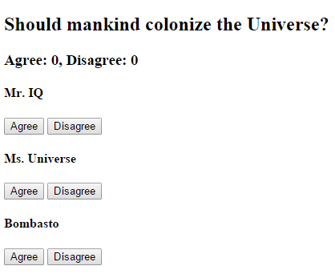

# Komponensek kommunikációja

## 1. Szemantikus verziószámozás példa

Komponensek kommunikációja

## 2. Szavazás példa
a) Készítsük el az alábbi funkciókkal rendelkező alkalmazást!

Komponensekre bontás

b) Fejlesszük tovább az alkalmazást: a szavazást megjelenítő komponens igen/nem válaszok helyett fogadjon előre megadott válaszlehetőségeket, amikre szavazni lehet!