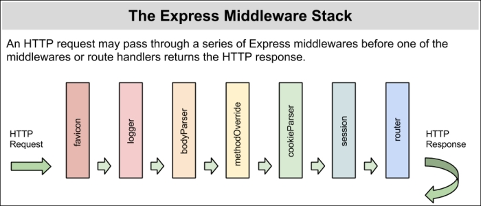

# Express.js szerver

## Globális függőségek telepítése

A következő parancsot **csak egyszer kell futtatni**, ennek hatására rendszer szinten települnek a szükséges csomagok:
```
npm install -g typescript ts-node ts-node-dev
```

## Projekt inicializálás

1. Projekt mappa létrehozása: `mkdir backend && cd backend`
2. NPM csomag létrehozása: `npm init`
3. tsconfig fájl létrehozása: `tsc --init`
4. Express.js csomag telepítése: `npm install express --save`
5. Típus csomagok telepítése: `npm install @types/node @types/express --save-dev`
6. `index.ts` fájl létrehozása.

## Szerver indítása

`ts-node-dev index.ts`

## Express alkalmazás működési logikája

Az Express alkalmazás ún. „middleware”-ek segítségével szolgálja ki a klienstől érkező kéréseket. A middleware egy függvény, mely valamilyen specifikus feladatot lát el.

A kliens kérése middleware függvények sorozatán halad át, mely során előáll a kérésre adott válasz.

([Néhány gyakran használt middleware dokumentációja](https://expressjs.com/en/resources/middleware.html))

> Express is a routing and middleware web framework that has minimal functionality of its own: An Express application is essentially a series of middleware function calls.
> 
> Middleware functions are functions that have access to the request object (req), the response object (res), and the next middleware function in the application’s request-response cycle.


